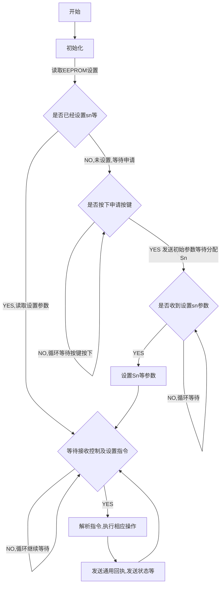

# LoRa开关型设备私有协议及实时状态回复详解

## 一. LoRa电磁阀协议详解

### 1 开关型设备实时状态回复(E014)

#### 返回协议帧格式

|   字节索引   |     0     |  1\|2   |    3    |     4\|5     |      6      |   7    |    8    |   9    | 10-11 |  12  |  13  |              14-29               |  30  |       31-36       |
| :----------: | :-------: | :-----: | :-----: | :----------: | :---------: | :----: | :-----: | :----: | :---: | :--: | :--: | :------------------------------: | :--: | :---------------: |
|    数据域    | FrameHead | FrameId | DataLen | DeviceTypeId | IsBroadcast | ZoneId | channel | status |  Vol  | Rssi | Csq  |             Allocate             | CRC8 |     FrameEnd      |
| 长度（byte） |     1     |    2    |    1    |      2       |      1      |   1    |    1    |   1    |   2   |  1   |  1   |                16                |  1   |         2         |
|   示例数据   |    FE     |  E014   |   12    |     C003     |     55      |   01   |   00    |   00   | 2EE0  |  FF  |  FF  | 00000000000000000000000000000000 |  00  | 0D 0A 0D 0A 0D 0A |

协议帧各字段域说明：

| 字段域       | 说明             | 长度（byte） | 备注                                                         |
| ------------ | :--------------- | :----------: | :----------------------------------------------------------- |
| FrameHead    | 帧头             |      2       | FE                                                           |
| FrameId      | 帧ID             |      2       | E014                                                         |
| DataLen      | 数据长度         |      1       | 从此位后开始计算（不包含自身），一直到`CRCR8`位结束（不包括CRC8位） |
| DeviceTypeId | 设备类型ID       |      2       | 查看设备类型对照表（5555：所有类型）                         |
| IsBroadcast  | 是否广播指令     |      1       | 0x55是，0x00否                                               |
| ZoneId       | 所属区域Id       |      1       | 0x55表示所有区域                                             |
| Addr         | 设备地址         |      4       | 设备地址（全部为00000071）                                   |
| status       | 设备当前工作状态 |      1       | **对应回执状态表(1.2)**                                      |
| Vol          | 电压             |      2       |                                                              |
| Rssi         | 性噪比           |      1       |                                                              |
| Csq          | 信号强度         |      1       |                                                              |
| Allocate     | 预留字段         |      16      | **对应预留字段使用说明(1.1)**                                |
| CRC8         | CRC8校验码       |      1       | 用于进行CRC8计算的数据DataLen指代的长度                      |
| FrameEnd     | 帧尾             |      6       | 0d 0a 0d 0a 0d 0a                                            |


#### 1.1 预留字段(14-29)实际使用说明

|   字节索引   |      14-16       |    17-19     |     20-22      |      23-29       |
| :----------: | :--------------: | :----------: | :------------: | :--------------: |
|    数据域    | CurrentOpenRatio | TotalWorkSec | CurrentWorkSec |     Allocate     |
| 长度（byte） |        3         |      3       |       3        |        7         |
|   示例数据   |      000000      |    0000FF    |     000000     | 0000000000000000 |

**CurrentOpenRatio**:设置开度

**TotalWorkSec**:设置工作时长

**CurrentWorkSec**:当前已工作时长

**Allocate**:根据不同开关型设备分别定义

#### 1.2 状态表

|  状态名  | FactoryMode |  RUN_OK  | CLOSE_OK | OPEN_EXCEPTION | CLOSE_EXCEPTION | LOW_POWER  | SENSOR_EXCEPTION |
| :------: | :---------: | :------: | :------: | :------------: | :-------------: | :--------: | :--------------: |
|  状态值  |     00      |    01    |    02    |       02       |       03        |     04     |        05        |
| 状态说明 |  出厂模式   | 设备开启 | 设备关闭 |  打开设备异常  |  关闭设备异常   | 低电压异常 |    传感器异常    |

### 2 LoRa开关通用回执状态表 

| 状态名   | FactoryMode |  AskUploadParamsOk   |  AskUploadParamsErr  | AssignGroupIdArrayOk | AssignGroupIdArrayErr | SetSnAndSlaverCountOk  | SetSnAndSlaverCountErr |    TrunOffOk     |    TrunOffErr    | SetParamsOk  | SetParamsErr |
| -------- | :---------: | :------------------: | :------------------: | :------------------: | :-------------------: | :--------------------: | :--------------------: | :--------------: | :--------------: | :----------: | :----------: |
| 状态值   |     00      |          01          |          02          |          03          |          04           |           05           |           06           |        07        |        08        |      09      |      0A      |
| 状态说明 |  出厂模式   | 查询LoRa设备参数成功 | 查询LoRa设备参数失败 |   设置组Id数组成功   |   设置组Id数组失败    | 设置SN及子设备路数成功 | 设置SN及子设备路数失败 | 强制停止设备成功 | 强制停止设备失败 | 设置参数成功 | 设置参数失败 |

## 二、LoRa开关型设备私有协议详解

**使用说明:**通用指令都需要

**设备使用流程:**

- 上报开关型设备参数及子设备路数**E011**(设备初始安装,按键上报)---->>服务器按照子设备路数分别添加多条记录(设备SN和地址一样,路数不一样)
- 前端设置控制器的SN\区域ID等信息(扫码绑定每一路的外围开关子设备,绑定相关设备信息)**A013**---->通用回执(**E015--一---2--05/06**)
- 前端分别编辑N路设备的设备信息(设备名称等)
- 分别添加N路设备到各自的执行器工作组(默认都在1组),修改各路工作组ID数组**A014**---->通用回执(**E015--一---2--03/04**)
- 组控或单控某类型开关设备**A025**---->通用回执(**E015--一---2--09/0A**)
- 设备分路数上报自己的实时状态**E014**(**不同设备类型的设备按照协议合成各自的Allocate字段**)

### 1. 设置LoRa开关设备开关参数及执行时间(A025)

1.1 协议帧格式

|   字节索引   |       N/A       |   N/A    |     N/A      |     0     |  1\|2   |    3    |     4-5      |      6      |   7    |    8    |       9       |   10-12   |  14-16  |      17-24       |  25  |       26-31       |
| :----------: | :-------------: | :------: | :----------: | :-------: | :-----: | :-----: | :----------: | :---------: | :----: | :-----: | :-----------: | :-------: | :-----: | :--------------: | :--: | :---------------: |
|    数据域    | DeviceFrameHead |   Addr   | deviceOthers | FrameHead | FrameId | DataLen | DeviceTypeId | IsBroadcast | zoneId | groupId | DeviceChannel | OpenRatio | WorkSec |     Allocate     | CRC8 |     FrameEnd      |
| 长度（byte） |        1        |    4     |      3       |     1     |    2    |    1    |      2       |      1      |   1    |    1    |       1       |     3     |    3    |        8         |  1   |         6         |
|   示例数据   |       61        | 14052A0C |   00 XXXX    |    FE     |  A025   |   13    |     C001     |     55      |   01   |   55    |      00       |  000000   | 000000  | 0000000000000000 |  00  | 0D 0A 0D 0A 0D 0A |

协议帧各字段域说明：

| 字段域          | 说明         | 长度（byte） | 备注                                                         |
| --------------- | :----------- | :----------: | :----------------------------------------------------------- |
| DeviceFrameHead | 硬件帧头     |      1       | 仁钰LoRa M-KL9按地址发送时需要                               |
| Addr            | 设备地址     |      4       |                                                              |
| deviceOthers    | 控制字等     |      3       | 仁钰LoRa M-KL9按地址发送时需要                               |
| FrameHead       | 帧头         |      2       | FE                                                           |
| FrameId         | 帧ID         |      2       | A001                                                         |
| DataLen         | 数据长度     |      1       | 从此位后开始计算（不包含自身），一直到`CRCR8`位结束（不包括CRC8位） |
| DeviceTypeId    | 设备类型ID   |      2       | 查看设备类型对照表                                           |
| IsBroadcast     | 是否广播指令 |      1       | 0x55是，00否                                                 |
| zoneId          | 区域Id       |      1       |                                                              |
| groupId         | 组id         |      1       |                                                              |
| DeviceChannel   | 设备路数     |      1       | 00：主设备,0x55:所有路设备                                   |
| OpenRatio       | 开度         |      3       | 0x000064全开，0x000000全关                                   |
| WorkSec         | 超时关闭时间 |      3       | 0x000000表示一直保持当前状态,单位秒,                         |
| Allocate        | 预留字段     |      8       |                                                              |
| CRC8            | CRC8校验码   |      1       | 用于进行CRC8计算的数据DataLen指代的长度                      |
| FrameEnd        | 帧尾         |      6       | 0d 0a 0d 0a 0d 0a                                            |

**应用示例：**

设置区域01下所有开关设备设备开度为50，一直保持打开状态

```json
61 00000071 000100 FE A025 12 C001 55 01 55 55 32 00000000 0000000000000000 D6 0D0A0D0A0D0A
```

设置区域01下的01组设备开度为50，设置打开时长10s

```c
61 00000071 000100 FE A025 12 C001 55 01 01 55 32 00000A 0000000000000000 F5 0D0A0D0A0D0A
```


## 三.LoRa电磁阀TYPE_A型设备详细说明

### 1 设备硬件接口

* N路继电器输出

* N路压力反馈

### 2 类型及帧Id定义

* **类型名称**:电磁阀A型
* **设备类型**:LoRa_Valve
*  **帧ID**:C003

### 3 预留字段(14-29)实际使用说明

|   字节索引   |      14-16       |    17-19     |     20-22      |     23-26     |  23-29   |
| :----------: | :--------------: | :----------: | :------------: | :-----------: | :------: |
|    数据域    | CurrentOpenRatio | TotalWorkSec | CurrentWorkSec | WaterPressure | Allocate |
| 长度（byte） |        3         |      3       |       3        |       4       |    3     |
|   示例数据   |      000000      |    0000FF    |     000000     |   999999E2    |  000000  |

**CurrentOpenRatio**:设置开度

**TotalWorkSec**:设置工作时长

**CurrentWorkSec**:当前已工作时长

**WaterPressure**:水压,单位为`kPa`，BCD码值，低位为符号位，符号位为`Ex`时为正，`Fx`时为负，其中`x`为小数位数

**Allocate**:根据不同开关型设备分别定义

### 4 程序流程图



